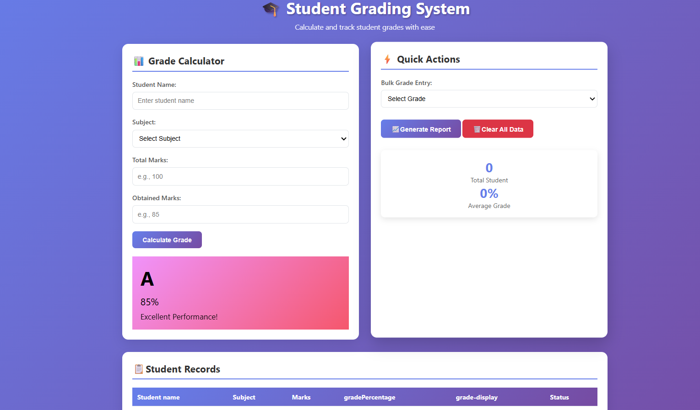

# 01 - Grading App



A lightweight, front-end grading system built with vanilla web technologies to calculate student results quickly.

<Image src="image_agent_tag_7330746892987321119" alt="Grading App Interface Preview" caption="Grading App User Interface" />

---

## 🛠️ Built With

- **HTML5** – Structure and layout
- **CSS3** – Styling and responsive design
- **JavaScript (ES6+)** – Grading logic and dynamic calculations

## 🚀 Getting Started

To run this project locally, simply clone the repository and open the project:

1. Clone the repo:
   ```bash
   git clone [https://github.com/rajvircodes/HTML-CSS-JS-projects.git](https://github.com/rajvircodes/HTML-CSS-JS-projects.git)
   ```
