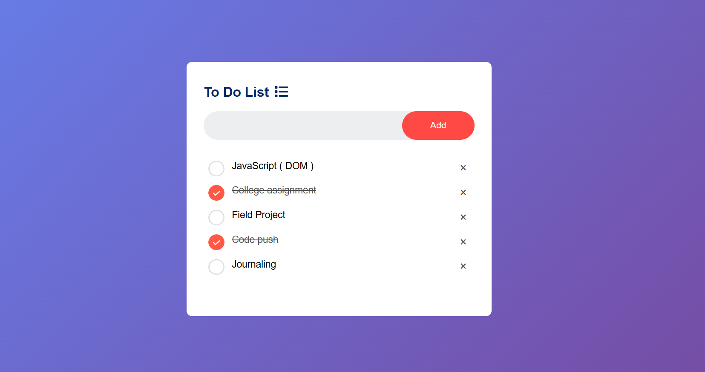

# 📝 To-Do List App

## 📸 Preview

**02-To-Do-App** – Basic to-do application for task management.  
     

---

## 🚀 Features
- ➕ Add new tasks  
- ✅ Mark tasks as completed  
- 🗑️ Delete tasks  
- 💾 Stores tasks in **local storage** (data stays even after refresh)  
- 📱 Responsive design for mobile & desktop  

---

## 🛠️ Technologies Used
- **HTML5** – Structure of the app  
- **CSS3** – Styling with responsive design  
- **JavaScript (ES6)** – Functionality and interactivity  

---

