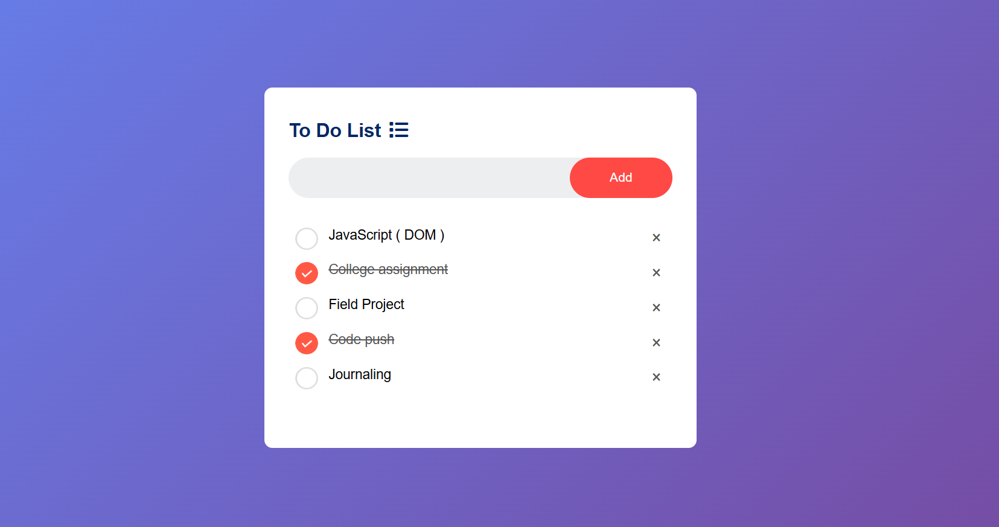

# 📝 To-Do List App

## 📸 Preview

**02-To-Do-App** – Basic to-do application for task management.  
 

---

## 🚀 Features

- ➕ Add new tasks
- ✅ Mark tasks as completed
- 🗑️ Delete tasks
- 💾 Stores tasks in **local storage** (data stays even after refresh)
- 📱 Responsive design for mobile & desktop

---

## 🛠️ Technologies Used

- **HTML5** – Structure of the app
- **CSS3** – Styling with responsive design
- **JavaScript (ES6)** – Functionality and interactivity

---

## 🚀 TypeScript Refactor

This project was originally built with vanilla JavaScript and was refactored to **TypeScript** to improve type safety and maintainability.

### Key TS Features Learned & Implemented:

- **DOM Type Assertions** (`as HTMLInputElement`, `as HTMLElement`)
- **Explicit Function Return Types** (`: void`)
- **Typed Mouse Events** (`MouseEvent`)
- **Null Safety** using Optional Chaining (`?.`)
