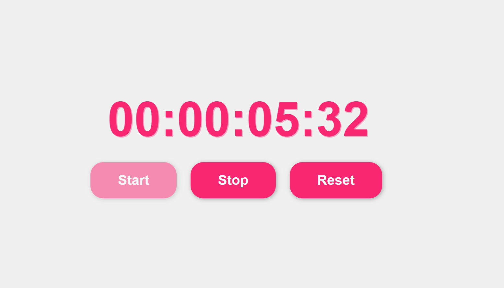

# 02. Stopwatch App

Functional, precise stopwatch application built with **TypeScript** and **HTML/CSS**.



## 🚀 Features

- **Start / Stop / Reset** functionality with dynamic button disabling states.
- **Millisecond Precision** displaying hours, minutes, seconds, and milliseconds.
- **TypeScript Built:** Type-safe DOM manipulations and state handling.

## 🛠️ TypeScript Learnings Implemented

- **Element-Specific Assertions:** Applied `as HTMLButtonElement` to safely manipulate `.disabled` state.
- **Union Types:** Declared `timerInterval` as `number | undefined` to represent timer states accurately.
- **Explicit Function Contracts:** Enforced types on parameter inputs (`elapsedTime: number`) and expected return values (`: string`).
- **Browser Window Scope:** Disambiguated browser-level timer IDs using `window.setInterval`.

## 📦 Run Locally

1. Compile TypeScript to JavaScript:
   ```bash
   npx tsc script.ts
   ```
