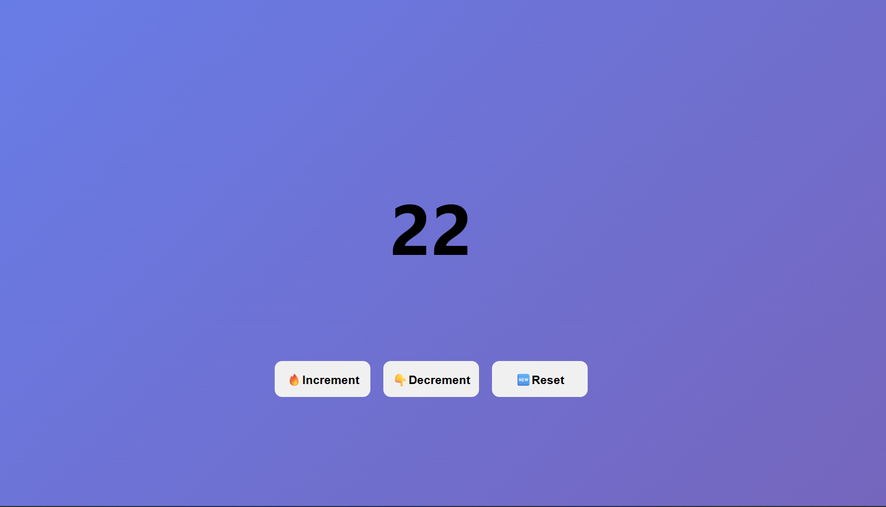

Simple counter application built with **TypeScript** and **HTML/CSS**.



## 🚀 Features
* **Increment / Decrement / Reset** state management.
* **Lower Bound Guard:** Prevents counter from dropping below zero.
* **TypeScript Refactored:** Strict type safety between numeric state and DOM text rendering.

## 🛠️ TypeScript Learnings Implemented
* **Type-Safe DOM Assignment:** Used `.toString()` to adhere to `textContent` string assignment rules.
* **`querySelector` Casting:** Typed elements selected via CSS class names.

## 📦 Run Locally
1. Compile TypeScript to JavaScript:
   ```bash
   npx tsc script.ts