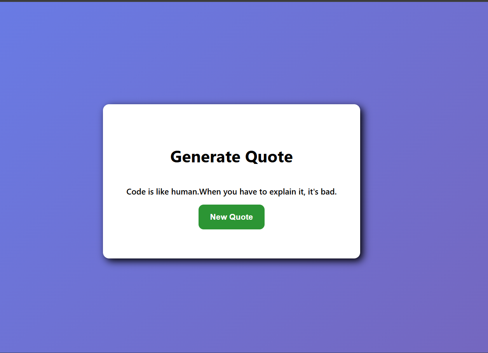

# 04. Quote Generator

Interactive quote generator built with **TypeScript** and **HTML/CSS**.



## 🚀 Features

- **Random Quote Selection:** Generates dynamic developer quotes on button click.
- **Clean UI:** Responsive glassmorphism-inspired layout.
- **TypeScript Refactored:** Implemented typed array safety and immutable constant data.

## 🛠️ TypeScript Learnings Implemented

- **Array Typing:** Used `string[]` to ensure uniform primitive collection structures.
- **Immutability:** Applied `readonly` modifier to preserve original quote data structures.

## 📦 Run Locally

1. Compile TypeScript to JavaScript:
   ```bash
   npx tsc script.ts
   ```
