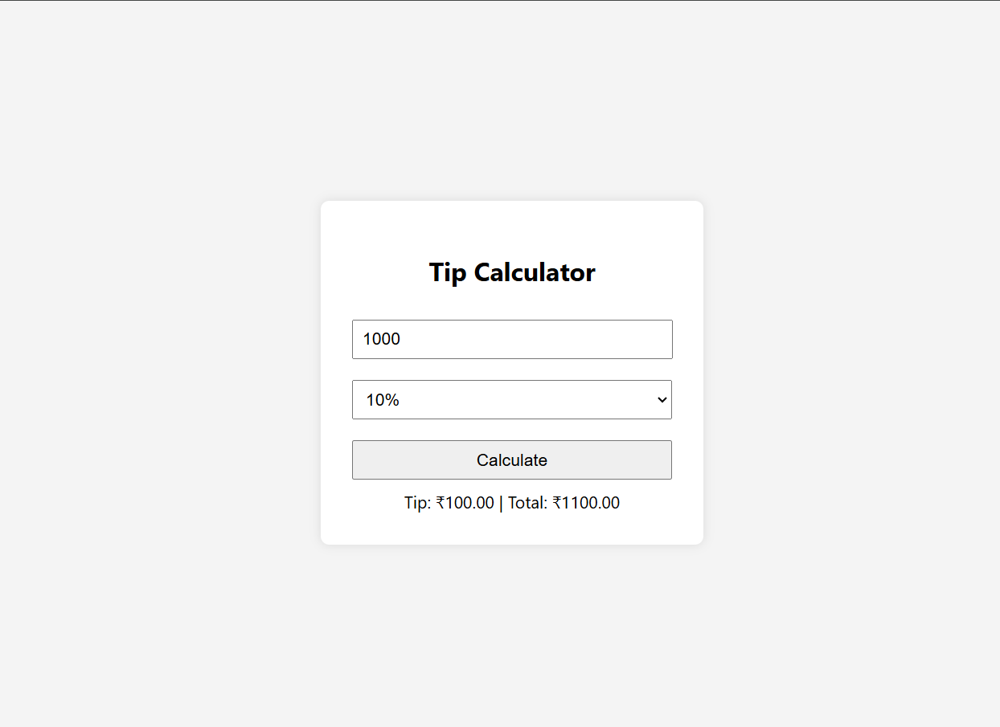

# 05. Tip Calculator

Dynamic tip and bill split calculator built with **TypeScript** and **HTML/CSS**.



## 🚀 Features

- **Custom Percentages:** Instant calculation based on predefined dropdown values.
- **Input Validation:** Guard clauses for empty or negative bill values.
- **Currency Formatting:** Formats totals to 2 decimal places using `.toFixed(2)`.

## 🛠️ TypeScript Learnings Implemented

- **Dropdown Selection Types:** Typed `<select>` DOM bindings using `HTMLSelectElement`.
- **Safe Property Access:** Structured element assertions prior to property extraction.

## 📦 Run Locally

1. Compile TypeScript to JavaScript:
   ```bash
   npx tsc script.ts
   ```
