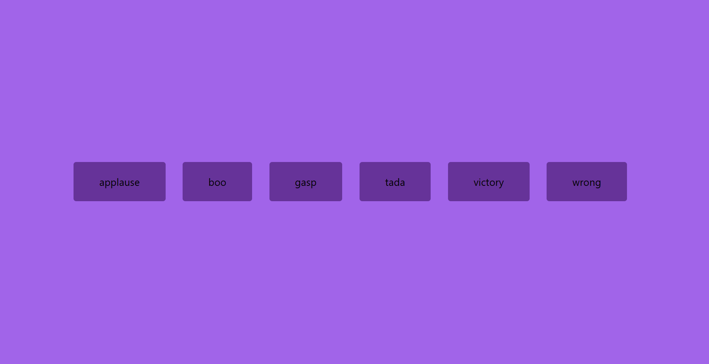

# 06. Sound Board

Interactive soundboard application built with **TypeScript** and **HTML/CSS**.



## 🚀 Features

- **Dynamic Audio Playback:** Plays selected audio clips on button click.
- **Audio Interruption:** Automatically stops currently playing sounds before starting a new track.
- **Dynamic UI Generation:** Generates UI buttons programmatically from an audio list.

## 🛠️ TypeScript Learnings Implemented

- **Audio API Types:** Leveraged `HTMLAudioElement` to strictly type audio playback methods.
- **Built-in Element Inference:** Utilized native DOM tag mapping with `document.createElement`.

## 📦 Run Locally

1. Compile TypeScript to JavaScript:
   ```bash
   npx tsc script.ts
   ```
